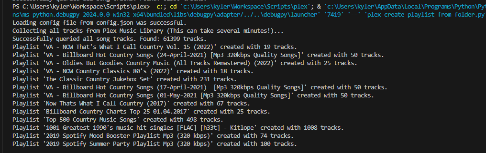

# Create Plex Playlists from Folders

This script allows you to create playlists in Plex from folders of music files. This script allows you to create multiple playlists in a single run.

Please note and understand how this tool works: a call is made to your Plex Music Library, and every single song track that exists in your Plex library is queried. This can take some time. I have a high performance server, with over 60,000 song tracks, and it takes abotu 256 seconds to pull every song title. 

After this completes, the rest is very fast and effiicent, as it runs locally within the stack. For every folder you have listed in PLAYLIST_FOLDERS, the tool will create Plex playlists with the containing songs. It is **VERY BENEFICIAL&** to run multiple playlist folders at once. But it's perfectly fine to run this individually. Expect a 3-5 minute runtime per execution.

## Prerequisites

- Python 3.6 or higher
- Plex Server API
- A Plex server running on your local machine or network

## Setup

1. Clone this repository to your local machine.
2. Install the required Python packages using pip:
`pip install -r requirements.txt`

3. Create a `config.json` file in the root directory of the project. Use the template provided below and replace the placeholders with your actual data.

## Configuration

Here's a template for your `config.json`:

```json
{
 "PLEX_URL": "https://localhost:32400",
 "PLEX_TOKEN": "{insert plex api token here}",
 "LIBRARY_NAME": "Audio",
 "SECONDS_TO_WAIT": "3600",
 "PYTHONWARNINGS": "ignore:Unverified HTTPS request",
 "PLAYLIST_FOLDERS": [
     "path/to/your/playlist/folder1",
     "path/to/your/playlist/folder2",
     "...",
     "path/to/your/playlist/folderN"
 ]
}
```

`PLEX_URL`: The URL of your Plex server (e.g., ‘https://localhost:32400’).<br>
`PLEX_TOKEN`: The token required to access your Plex API. See here for instructions on how to get your Plex token.<br>
`LIBRARY_NAME`: The name of your Music library in Plex (e.g., ‘Music’)<br>.
`SECONDS_TO_WAIT`: The number of seconds to wait between requests to the Plex server. Adjust this value as needed to avoid overloading your server.<br>
`PYTHONWARNINGS`: This should be set to “ignore:Unverified HTTPS request” to suppress Python warnings about unverified HTTPS requests.<br>
`PLAYLIST_FOLDERS`: An array of strings, where each string is the path to a folder of music files that you want to turn into a playlist. You can specify one or more folders

## Usage
Run the script from the command line:
`python main.py config.json`

The script will create a new playlist in Plex for each folder specified in PLAYLIST_FOLDERS. The name of the playlist will be the name of the folder.

## Example

Here is an example config.json file which is exactly what I have ran on my Plex server, except without the plex api token.
```json
{
    "PLEX_URL": "https://localhost:32400",
    "PLEX_TOKEN": "{insert plex api token here}",
    "LIBRARY_NAME": "Audio",
    "MEDIA_TYPE": "movie",
    "SECONDS_TO_WAIT": "3600",
    "PYTHONWARNINGS": "ignore:Unverified HTTPS request",
    "PLAYLIST_FOLDERS": [
        "J:\\Audio\\Collections (Various Artists)\\VA - NOW That's What I Call Country Vol. 15 (2022)",
        "J:\\Audio\\Collections (Various Artists)\\VA - Billboard Hot Country Songs (24-April-2021) [Mp3 320kbps Quality Songs]",
        "J:\\Audio\\Collections (Various Artists)\\VA - Oldies But Goodies Country Music (All Tracks Remastered) (2022)",
        "J:\\Audio\\Collections (Various Artists)\\VA - NOW Country Classics 80's (2022)",
        "J:\\Audio\\Collections (Various Artists)\\The Classic Country Jukebox Set",
        "J:\\Audio\\Collections (Various Artists)\\VA - Billboard Hot Country Songs (17-April-2021)  [Mp3 320kbps Quality Songs]",
        "J:\\Audio\\Collections (Various Artists)\\VA - Billboard Hot Country Songs (01-May-2021 [Mp3 320kbps Quality Songs]",
        "J:\\Audio\\Collections (Various Artists)\\Now Thats What I Call Country (2017)",
        "J:\\Audio\\Collections (Various Artists)\\Billboard Country Charts Top 25 01.04.2017",
        "J:\\Audio\\Collections (Various Artists)\\Top 500 Country Music Songs",
        "J:\\Audio\\Collections (Various Artists)\\1001 Greatest 1990's music hit singles [FLAC] [h33t] - Kitlope",
        "J:\\Audio\\Collections (Various Artists)\\2019 Spotify Mood Booster Playlist Mp3 (320 kbps)",
        "J:\\Audio\\Collections (Various Artists)\\2019 Spotify Summer Party Playlist Mp3 (320 kbps)"
    ]
}
```
A Plex Playlist under the Playlists section was made for every single one of these.

